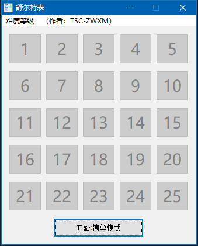

# 介绍

- 舒尔特表的MFC实现，锻炼注意力小游戏
- 拥有简单模式和复杂模式，前者是固定顺序，后者每次点击都会随机
- 相关发布：http://tieba.baidu.com/p/3533353918?pid=63115408509&cid=0#63115408509

# 注意

- 中文代码GB2313编码
- 可运行于XP、win7、win8、win10
- vs2013编写

# 例子

